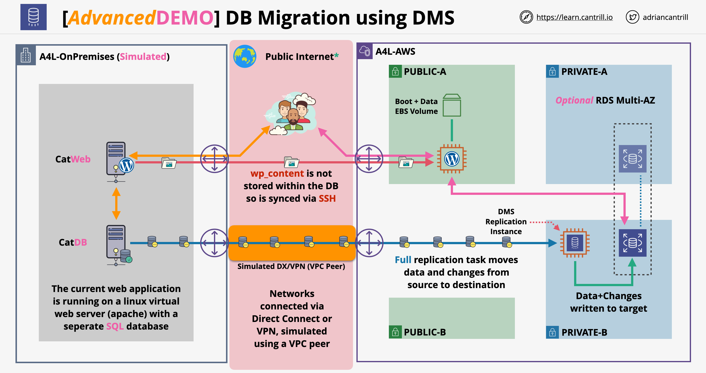

# 🔄 AWS Database Migration Using DMS

This project documents the migration of a relational database using **AWS Database Migration Service (DMS)**. It demonstrates how to replicate data from an on-premises or self-hosted database to an AWS RDS instance.

---

## 📘 Overview

**Problem:** Migrate an existing database with minimal downtime to AWS.

**Solution:** Use AWS DMS to perform a full load and ongoing replication from the source database to an Amazon RDS target.

---

## 🏗️ Architecture

### Flow Summary:
- Source database: On-premises or EC2-hosted MySQL/PostgreSQL
- AWS DMS Replication Instance performs data migration
- Target database: Amazon RDS (MySQL/PostgreSQL)
- CloudWatch used for replication monitoring

---

## 🛠️ AWS Services Used

- **AWS DMS** – Data migration and replication
- **Amazon RDS** – Target database
- **Amazon EC2** – (Optional) Source DB host
- **CloudWatch** – Monitor replication task progress and errors
- **IAM** – Permissions for DMS to access source and target

---

## 🔐 Security Practices

- **Source/Target DB** accessed via secure endpoints (SSL)
- **Replication Instance** placed in private subnet within VPC
- **IAM Role** created with required policies for DMS
- **CloudWatch Alarms** configured to track replication lag/errors

---

## 🖼️ Screenshots

Find screenshots in the `/screenshots` folder:
- DMS Replication Instance configuration
- Replication task setup
- Source and target endpoint test connection results
- CloudWatch monitoring metrics

---

## 🧠 Lessons Learned

- Learned how to migrate production databases with low downtime
- Understood DMS task phases: Full Load, CDC (Change Data Capture)
- Practiced IAM scoping for DMS access to endpoints
- Identified common migration issues (schema mismatches, data type differences)

---

## ✍️ Author

Dom Pine – Cloud Security & AWS Learner  
[LinkedIn](https://linkedin.com) | [Portfolio](https://yourportfolio.com)
