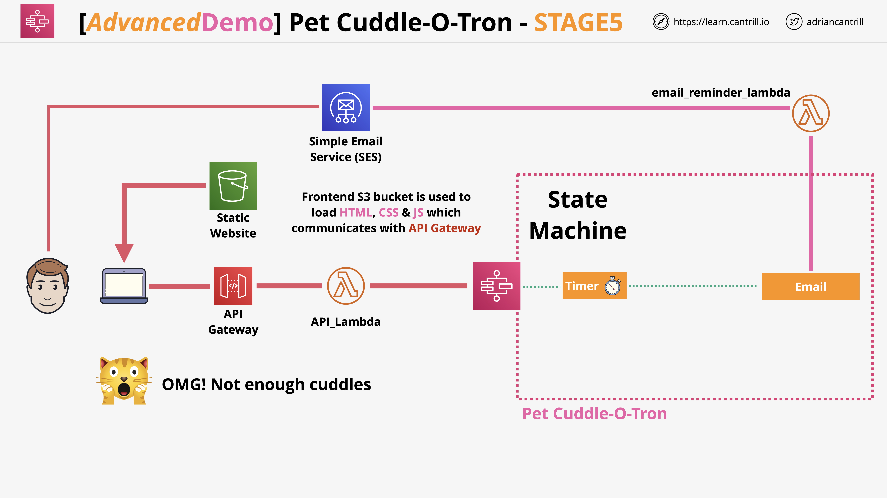

# 🐾 AWS Serverless Pet Cuddle-O-Tron

A serverless AWS project that allows users to book virtual cuddle sessions with pets (dogs, cats, etc.) via API Gateway and Lambda, using DynamoDB and S3 — built entirely via the AWS Console.

---

## 📘 Overview

**Problem:** Users want to schedule fun, virtual cuddle sessions with pets.  
**Solution:** A serverless architecture using AWS services to manage pet profiles, booking requests, and session history.

---

## 🏗️ Architecture

### Flow Summary:
- API Gateway exposes REST endpoints
- Lambda functions handle business logic (bookings, listings)
- DynamoDB stores pet/session data
- S3 stores pet images
- IAM roles are scoped for least privilege

---

## 🛠️ AWS Services Used

- **API Gateway** – REST endpoints
- **AWS Lambda** – Business logic (no code committed)
- **DynamoDB** – Pet and session data
- **S3** – Image storage for pet profiles
- **CloudWatch** – Logs and metrics
- **IAM** – Role-based access control

---

## 🔐 Security Practices

- IAM roles scoped to individual Lambda functions
- S3 buckets block public access
- Encryption enabled 
- Logging and monitoring via CloudWatch and CloudTrail

---

## 🎥 Walkthrough Video

A full video walkthrough documents the deployment and testing of the **Cuddle-O-Tron** serverless application using AWS Lambda, API Gateway, and S3.

The video includes:
- Lambda function setup
- API Gateway configuration for triggering the function
- S3 bucket used to serve static assets 
- End-to-end demo of how the app works via web interface

📹 (https://youtu.be/YdvCBG6NJtg)

---

## 📚 Lessons Learned

- Built full serverless backend using AWS Console (no local code)
- Practiced IAM least-privilege role design
- Gained hands-on experience with API Gateway, Lambda, and DynamoDB

---

## ✍️ Author

Dominic Pinedo
