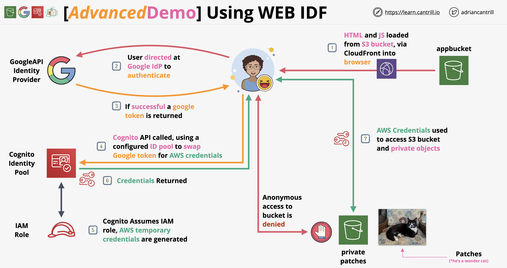

# 🔐 AWS Serverless App with Web Identity Federation

A serverless AWS application that uses **Web Identity Federation** to allow users to authenticate using a third-party identity provider (Google) and interact with AWS resources securely via temporary credentials.

---

## 📘 Overview

**Problem:** Users need secure, short-term access to AWS resources without managing long-term credentials.

**Solution:** This project uses Web Identity Federation to allow users to log in with Google , exchange the token with AWS STS, and access S3 with temporary credentials.

---

## 🏗️ Architecture

### Flow Summary:
- User logs in with Google → receives token
- Token is exchanged with AWS STS via an IAM Role for temporary credentials
- Credentials are scoped to allow limited access (e.g., upload to S3)

---

## 🛠️ AWS Services Used

- **STS (Security Token Service)** – To generate temporary credentials
- **IAM Roles** – With trust policies for federated identities
- **S3** – Accessed using temporary creds

---

## 🔐 Security Practices

- Web Identity Federation configured with **Google**
- IAM trust policy allows `AssumeRoleWithWebIdentity`
- IAM policy limits what temporary credentials can do (e.g., `s3:PutObject` only)
- S3 buckets block public access, SSE enabled

---

## 🎥 Walkthrough Video

This project includes a full walkthrough video demonstrating how Web Identity Federation (WIF) is used to allow users authenticated through a third-party identity provider (e.g., Google ) to securely access AWS resources.

The video includes:
- Creating and configuring an IAM role with a web identity trust policy
- Registering and configuring the identity provider (Google/Facebook)
- Using the temporary credentials to access AWS services (e.g., S3)
- Testing the access flow from a web or mobile client

📹 [Insert your YouTube or Google Drive link here]

---

## 📚 Lessons Learned

- Learned how to configure Web Identity Federation with STS
- Understood temporary credential lifecycle and session duration
- Practiced writing trust policies and permission boundaries

---

## ✍️ Author

Dominic Pinedo 
